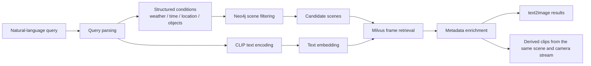
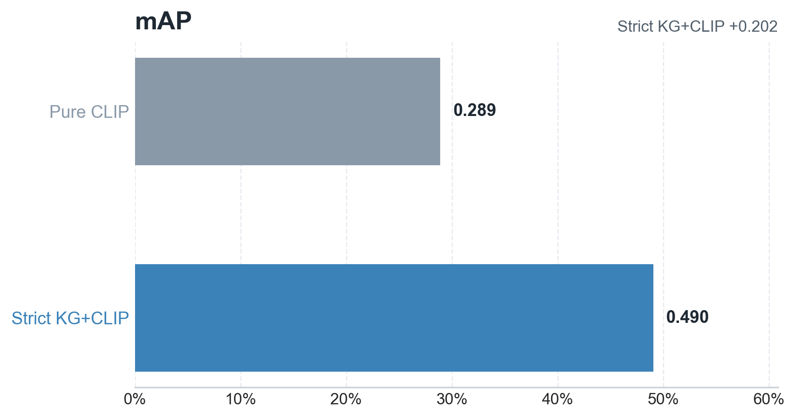
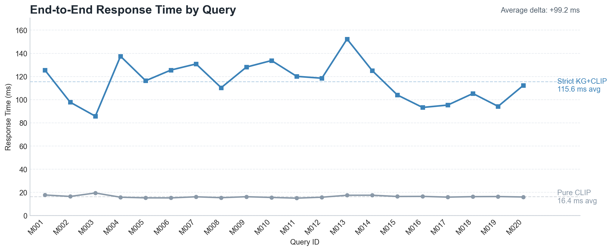

# KG Scene Retrieval

Knowledge-graph-guided cross-modal retrieval for driving scenes.

This project builds a bilingual driving-scene retrieval system that combines scene-level knowledge graph filtering with frame-level CLIP similarity search. Given a natural-language query in Chinese or English, the system parses structured conditions such as weather, time of day, location, and object types, filters candidate scenes with Neo4j, retrieves relevant frames from Milvus, and returns either image results or short derived video clips.

## Why This Project

Autonomous-driving datasets are large, multimodal, and difficult to search with traditional tags alone. Pure vector retrieval is strong at semantic matching, but weak at enforcing structured conditions such as:

- rainy night
- intersection
- pedestrian present
- urban-road scene constraints

This repository explores a practical middle ground:

- use a knowledge graph for structured scene filtering
- use CLIP for semantic alignment between text and visual content
- keep the system explainable, reproducible, and benchmarkable

## Highlights

- Scene-level knowledge graph filtering with Neo4j
- Frame-level similarity search with Milvus and CLIP
- Chinese and English natural-language query support
- `text2image` image retrieval and `text2video` derived clip output
- Gradio interface for interactive search and visualization
- Offline benchmark pipeline for comparing pure CLIP and KG-enhanced retrieval

## Retrieval Pipeline



The online flow is:

```text
query
-> parse_query
-> get_candidate_scene_tokens
-> encode_text_query
-> search_frame_hits
-> enrich_hit_record
-> render images or derive video clips
```

## Retrieval Modes

### `text2image`

- Returns the most relevant driving-scene frames
- Shows similarity score, scene, camera, weather, time, location, and object metadata

### `text2video`

- Uses retrieved anchor frames as entry points
- Collects consecutive frames from the same scene and camera stream
- Generates short playable clips for qualitative inspection

## Benchmark Snapshot

Main benchmark results from `benchmark/runs/manual_query_seed_scene_main_e2e_median`:

| Strategy | Precision@5 | Recall@5 | mAP | ConstraintConsistency@5 | Avg Response Time (s) |
| --- | ---: | ---: | ---: | ---: | ---: |
| `pure_clip` | 0.080 | 0.400 | 0.289 | 0.320 | 0.016 |
| `kg_clip_strict` | 0.110 | 0.550 | 0.490 | 0.755 | 0.116 |

This shows the core tradeoff of the project:

- KG constraints improve relevance and condition consistency
- stricter filtering also introduces extra latency

### Result Figures

**mAP comparison**



**Response time comparison**



## Current Runtime Scope

The repository currently runs against the configuration defined in [`config.py`](config.py), with these defaults:

- Dataset version: `v1.0-trainval`
- Active subset: `trainval_camera_part06_part10`
- Milvus collection: `multimodal_search_trainval_camera_part06_part10`
- Primary camera: `CAM_FRONT`

If you move the project to another machine, update paths and service settings in [`config.py`](config.py) first.

## Tech Stack

| Layer | Tools |
| --- | --- |
| UI | Gradio |
| Text-Image Models | English-CLIP, Chinese-CLIP |
| Knowledge Graph | Neo4j |
| Vector Search | Milvus |
| Dataset | nuScenes |
| Core Language | Python |

## Quick Start

### 1. Environment

This project uses the Conda environment `kg`.

```bash
conda run -n kg python ...
conda run -n kg pip install -r requirements.txt
```

Do not use the system default `python` or `pip`.

### 2. Prepare data and services

Make sure the following are available and correctly configured in [`config.py`](config.py):

- nuScenes metadata and image assets
- English-CLIP and Chinese-CLIP model directories
- Milvus host and port
- Neo4j host and port

### 3. Start the app

```bat
start.bat
```

Optional checks:

```bat
start.bat --check
```

Optional temporary public share link:

```bat
start.bat --share
```

Default local endpoints:

- Web UI: `http://127.0.0.1:7860`
- Attu: `http://127.0.0.1:8000`
- Neo4j Browser: `http://127.0.0.1:7474`

## Data Preparation

### Prepare the configured trainval subset

```bash
conda run -n kg python scripts\prepare_trainval06_subset.py
```

### Build the Neo4j scene graph

```bash
conda run -n kg python scripts\kg_builder.py --write
```

### Insert frame embeddings into Milvus

```bash
conda run -n kg python scripts\insert_image.py --drop-existing
```

Use `--drop-existing` only when you need to rebuild the collection or schema.

## Evaluation

Run the main benchmark with:

```bash
conda run -n kg python scripts\evaluate.py benchmark\manual_query_benchmark_seed_scene_eval.csv --output-dir benchmark\runs\manual_query_seed_scene_main_e2e_median --strategies pure_clip kg_clip_strict
```

The repository currently distinguishes between two important evaluation settings:

- `kg_clip_strict`: thesis-style strict KG filtering
- `kg_clip_engineering`: UI-oriented engineering fallback behavior

## Repository Map

```text
KG_Scene_Retrieval/
├─ app.py
├─ config.py
├─ start.bat
├─ requirements.txt
├─ src/
│  ├─ kg_builder.py
│  ├─ milvus_utils.py
│  ├─ nlp_parser.py
│  ├─ nuscenes_metadata.py
│  └─ trainval_subset.py
├─ scripts/
├─ docs/
├─ tests/
├─ benchmark/
├─ derived_data/
├─ generated_videos/
├─ csvdata/
└─ models/
```

## Documentation

- [`docs/项目解释-简版.md`](docs/项目解释-简版.md): quick project overview
- [`docs/项目解释-详尽版.md`](docs/项目解释-详尽版.md): detailed system walkthrough
- [`docs/毕业设计图纸_定稿版.md`](docs/毕业设计图纸_定稿版.md): architecture and figure drafts

## Project Notes

- The system is designed as a research-oriented retrieval prototype rather than a generic media search engine.
- Large local assets such as dataset blobs, model weights, generated videos, and runtime caches are intentionally kept outside normal source control workflows.
- For deployment, expose only the application entry point and avoid directly exposing Milvus or Neo4j service ports to the public internet.

## License

This repository is intended for research and educational use. If you plan to publish or extend it further, make sure dataset, model, and third-party component licenses are handled appropriately.
