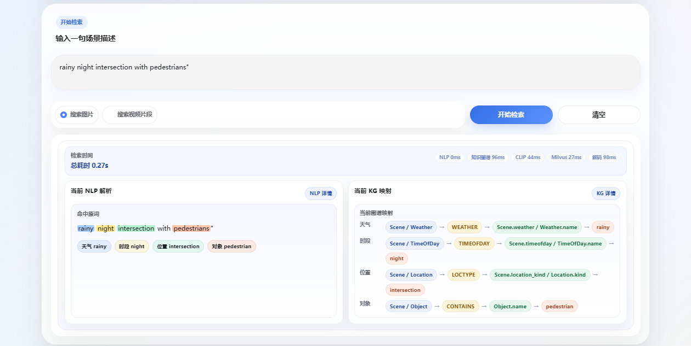
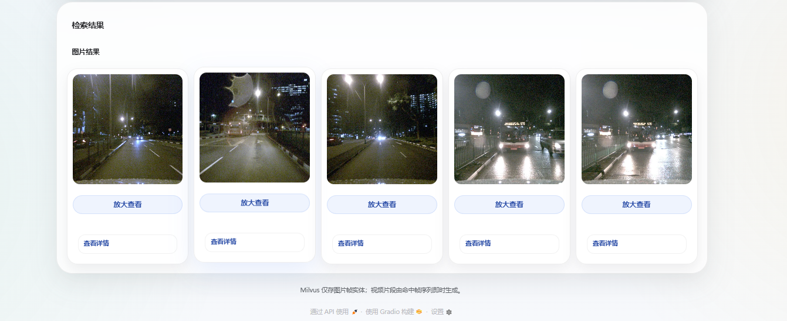
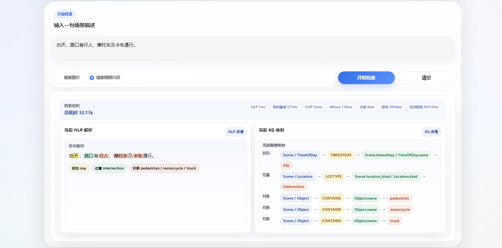
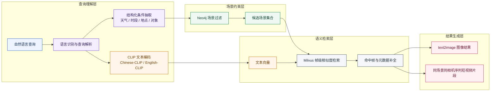

# KG Scene Retrieval

基于知识图谱与自然语言驱动的跨模态驾驶场景检索系统。

本项目为长安大学本科毕业设计《知识图谱与自然语言驱动的跨模态驾驶场景检索方法研究（2026）》的工程实现与实验仓库。

本项目面向自动驾驶场景数据检索任务，结合知识图谱的结构化约束能力与 CLIP 的跨模态语义对齐能力，构建了一套支持中英文自然语言输入的驾驶场景检索原型系统。系统能够先对查询中的天气、时段、地点、目标对象等条件进行解析，再利用 Neo4j 对候选场景进行过滤，最后在 Milvus 中完成相似帧检索，并返回图像结果或短视频片段结果。

## 项目背景

随着自动驾驶与智能交通技术的发展，驾驶场景数据规模持续增长。传统基于标签或人工筛选的方式难以高效支持如下类型的查询：

- 雨天夜晚路口有行人
- 白天高速上有卡车
- intersection with pedestrians at night
- urban road scene with vehicles

纯向量相似度检索虽然具有较强的语义匹配能力，但面对多条件联合约束时，往往难以同时保证结果相关性与条件一致性。本项目尝试采用“知识图谱过滤 + 向量检索排序”的思路，在保持语义检索能力的同时，增强复杂驾驶场景查询的可控性与可解释性。

## 项目亮点

- 基于 Neo4j 的 scene 级知识图谱过滤
- 基于 CLIP 与 Milvus 的 frame 级跨模态检索
- 支持中文与英文自然语言查询
- 支持图像检索与短视频片段结果展示
- 提供可运行的 Gradio 检索界面
- 提供离线 benchmark、结果图表与实验分析材料

## 系统截图

### 首页概览


> 图 1 系统首页。

### 查询解析与 KG 映射示例



> 图 2 英文查询解析结果。

### `text2image` 检索结果



> 图 3 `text2image` 检索结果。

### 复杂条件解析示例



> 图 4 中文复杂查询解析结果。

### `text2video` 检索结果


> 图 5 `text2video` 检索结果。

## 系统流程



> 图 6 在线检索流程。

## 检索模式

### `text2image`

- 返回最相关的驾驶场景图像帧
- 展示相似度分数、场景、相机、天气、时段、地点和对象信息

### `text2video`

- 先检索命中帧作为锚点
- 再从同一场景、同一相机序列中收集连续帧
- 动态生成可播放的短视频片段，用于结果展示与定性分析

## 成果摘要卡片

| 维度 | 结果 |
| --- | --- |
| 检索模式 | `text2image` / `text2video` |
| 主体流程 | 查询解析 → KG 场景过滤 → CLIP 文本编码 → Milvus 帧级检索 → 图像或视频结果生成 |
| 主实验提升 | `mAP: 0.289 → 0.490` |
| 典型优势 | 对天气、时段、地点、对象等多条件查询更稳定 |
| 交互能力 | 支持中英文自然语言输入与可视化结果展示 |

## 实验结果概览

主实验结果来自 `benchmark/runs/manual_query_seed_scene_main_e2e_median`：

| 方法 | Precision@5 | Recall@5 | mAP | 平均响应时间（s） |
| --- | ---: | ---: | ---: | ---: |
| `pure_clip` | 0.080 | 0.400 | 0.289 | 0.016 |
| `kg_clip_strict` | 0.110 | 0.550 | 0.490 | 0.116 |

可以看到：

- 引入知识图谱约束后，检索结果的相关性都有明显提升
- 更严格的结构化过滤会带来一定额外时延，但整体结果质量更高

### 结果图表


> 图 7 mAP 对比


> 图 8 Precision@5 对比


> 图 9 Recall@5 对比


> 图 10 平均响应时间对比。

## 当前运行配置

当前仓库默认以 [`config.py`](config.py) 中的配置为准，主要包括：

- 数据版本：`v1.0-trainval`
- 当前实验子集：`trainval_camera_part06_part10`
- Milvus collection：`multimodal_search_trainval_camera_part06_part10`
- 主要相机：`CAM_FRONT`

如果迁移到新机器，请优先修改 [`config.py`](config.py) 中的路径和服务配置。

## 技术栈

| 层级 | 技术 |
| --- | --- |
| 界面 | Gradio |
| 跨模态模型 | English-CLIP、Chinese-CLIP |
| 知识图谱 | Neo4j |
| 向量检索 | Milvus |
| 数据集 | nuScenes |
| 主要语言 | Python |

## 快速开始

### 1. 环境准备

项目默认使用 Conda 环境 `kg`：

```bash
conda run -n kg python ...
conda run -n kg pip install -r requirements.txt
```

请不要使用系统默认 `python` 或 `pip`。

### 2. 数据与服务

请先确保以下资源已经在 [`config.py`](config.py) 中正确配置：

- nuScenes 元数据与图像资源
- English-CLIP 与 Chinese-CLIP 模型目录
- Milvus 服务地址与端口
- Neo4j 服务地址与端口

### 3. 启动系统

Windows 下推荐直接运行：

```bat
start.bat
```

可选自检：

```bat
start.bat --check
```

可选临时公网分享：

```bat
start.bat --share
```

默认本地入口：

- Web UI: `http://127.0.0.1:7860`
- Attu: `http://127.0.0.1:8000`
- Neo4j Browser: `http://127.0.0.1:7474`

## 数据准备

### 准备 trainval 子集

```bash
conda run -n kg python scripts\prepare_trainval06_subset.py
```

### 构建 Neo4j 场景知识图谱

```bash
conda run -n kg python scripts\kg_builder.py --write
```

### 将图像帧向量写入 Milvus

```bash
conda run -n kg python scripts\insert_image.py --drop-existing
```

仅在需要重建 collection 或 schema 时使用 `--drop-existing`。

## 评测方式

运行主实验 benchmark：

```bash
conda run -n kg python scripts\evaluate.py benchmark\manual_query_benchmark_seed_scene_eval.csv --output-dir benchmark\runs\manual_query_seed_scene_main_e2e_median --strategies pure_clip kg_clip_strict
```

当前仓库中与实验相关的两种主要口径为：

- `kg_clip_strict`：更适合作为论文主实验设置
- `kg_clip_engineering`：更接近在线系统中的工程回退逻辑

## 仓库结构

```text
KG_Scene_Retrieval/
├─ app.py
├─ config.py
├─ start.bat
├─ requirements.txt
├─ src/
│  ├─ kg_builder.py
│  ├─ milvus_utils.py
│  ├─ nlp_parser.py
│  ├─ nuscenes_metadata.py
│  └─ trainval_subset.py
├─ scripts/
├─ docs/
├─ tests/
├─ benchmark/
├─ derived_data/
├─ generated_videos/
├─ csvdata/
└─ models/
```

## 项目文档

- [`docs/项目解释-简版.md`](docs/项目解释-简版.md)：适合快速建立整体认识
- [`docs/项目解释-详尽版.md`](docs/项目解释-详尽版.md)：适合系统性阅读源码和实验链路

## 说明

- 本项目更偏向研究型检索原型系统，而不是通用媒体搜索产品
- 数据集、模型权重、生成视频和运行缓存等大资源默认不纳入常规源码管理
- 如果需要部署对外访问版本，请只暴露应用入口，不要直接公开 Milvus 或 Neo4j 端口

## License

本仓库主要用于研究、教学与毕业设计相关场景。若后续继续公开发布或扩展，请根据数据集、模型和第三方组件的许可证补充相应说明。
